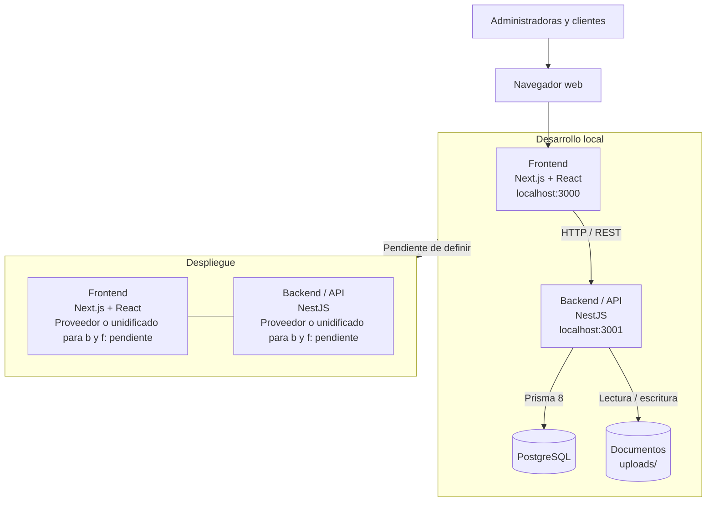

# Sistema web de gestión TRIBUTEK


## Índice (Por actualizar)

- [Introducción](#introducción)
- [Estado del desarrollo](#estado-del-desarrollo)
- [Tecnologías](#tecnologías)
- [Arquitectura](#arquitectura)
- [Preparación del entorno](#preparación-del-entorno)
- [Ejecución local](#ejecución-local)
- [Comprobaciones del frontend](#comprobaciones-del-frontend)
- [Documentación](#documentación)
- [Trabajo colaborativo](#trabajo-colaborativo)

## Introducción

TRIBUTEK es un sistema web de gestión para una oficina contable,
desarrollado por Nazaret González y Brandon Casas como proyecto de Capstone.

El alcance contiene gestión de clientes y servicios, antecedentes,
documentos, seguimiento mensual, cobranzas y un Portal Cliente.

Las cuentas previstas son Administradora y Cliente, sin registro público.
Cada cliente deberá acceder únicamente a su información y a los documentos
habilitados para él por las Administradoras/Equipo encargado.

La proyección F29 será un documento de apoyo descargable, no incluye
presentación oficial al SII hasta el momento. Los mensajes serán revisables para su posterior envío por WhatsApp.

## Objetivos 

### Objetivo general

Desarrollar una plataforma web para TRIBUTEK que permita centralizar y gestionar la información, documentación y servicios asociados a sus clientes, facilitando los procesos de gestión contable, tributaria y laboral.


### Objetivos específicos

- Diseñar una base de datos que permita almacenar y relacionar información de clientes, empresas, documentos y servicios.

- Desarrollar módulos que permitan a TRIBUTEK gestionar clientes, documentación y actividades asociadas a sus servicios.

- Implementar un portal para que los clientes puedan consultar y entregar la información y documentación requerida.

- Implementar mecanismos de autenticación y control de acceso según los diferentes tipos de usuario.


## Estado del desarrollo

Estado revisado al 10 de septiembre de 2026:

- Frontend con interfaz de login, layout administrativo, encabezado,
  menú de navegación y componentes reutilizables Button e Input.

- Páginas provisionales de Auditoría, Documentos, Proyección F29,
  Pagos y Recursos Humanos. Muestran que la sección aún no está disponible.

- Compilación del frontend y comprobación de TypeScript completadas
  en las entregas de estructura y navegación.

- Backend  aún básico de NestJS con una operación GET / este devuelve
  "Hello World!" únicamente para primera prueba.

- Contrato de Prisma con modelos de usuarios, roles, clientes, servicios,
  períodos, trabajadores, documentos, proyecciones F29, transacciones,
  gestiones y auditoría.

- Artefactos del contrato y archivos de migraciones registrados
  en el repositorio.

## Tecnologías

| Capa | Tecnología | Versión | Uso |
| --- | --- | --- | --- |
| Frontend | Next.js | 16.3.4 | Framework de la aplicación web |
| Frontend | React | 19.2.8 | Construcción de la interfaz |
| Frontend | TypeScript | ^5 | Tipado estático |
| Frontend | Tailwind CSS | ^4 | Estilos y diseño de la interfaz |
| Backend | NestJS | ^12.0.1 | Framework de la API REST |
| Backend | TypeScript | ^6.0.2 | Desarrollo del backend |
| Backend | ES Modules | — | Sistema de módulos |
| Datos | Prisma | ^8.0.0-rc.13 | ORM y acceso a datos |
| Datos | @prisma/orm-postgres | ^8.0.0-rc.8 | Integración de Prisma con PostgreSQL |
| Base de datos | PostgreSQL | 18.6 | Gestión y almacenamiento de datos |
| Desarrollo | concurrently | ^9.0.0 | Ejecución simultánea de frontend y backend |

> **Versiones:** los `package-lock.json` fijan las versiones exactas de las dependencias instaladas.
>
> **Configuración:** frontend y backend mantienen configuraciones independientes.

## Arquitectura

### Estructura de carpetas del proyecto

```text
Capstone-TRIBUTEK/
├── README.md                    # Descripción, arquitectura y guía del proyecto
├── Fase 1/                      # Evidencias grupales e individuales del capstone fase 1
├── Fase 2/                      # Evidencias grupales e individuales del capstone fase 2
│
└── tributek/                    # Aplicación y documentación del sistema
    ├── package.json             # Comandos generales para ejecutar frontend y backend
    ├── package-lock.json        # Versiones de las herramientas generales
    ├── backend/                 # API, lógica de negocio y acceso a datos
    │   ├── src/                 # Módulos, controladores y servicios NestJS
    │   ├── prisma/              # Contrato y modelos de datos
    │   ├── migrations/          # Cambios versionados de la base de datos
    │   ├── scripts/             # Tareas auxiliares del backend
    │   ├── test/                # Pruebas del backend
    │   ├── uploads/             # Archivos cargados durante el desarrollo local
    │   └── prisma.config.ts     # Configuración de Prisma y conexión a la base de datos
    │
    ├── docs/                    # Guías técnicas y material de referencia
    │   ├── backend/             # Documentación de la API y sus módulos
    │   ├── frontend/            # Documentación de interfaz y componentes
    │   ├── img/                 # Imágenes para las guías
    │   └── instalacion/         # Instrucciones de preparación del entorno
    │
    ├── frontend/                # Aplicación web Next.js y React
    │   ├── app/                 # Rutas, páginas, layouts y componentes
    │   ├── public/              # Recursos estáticos servidos por la aplicación
    │   └── tests/               # Pruebas del frontend
    │
    └── img/                     # Imágenes generales del proyecto
```

Next.js organiza las rutas y la interfaz. NestJS implementa la API,
la lógica de negocio y los permisos. Prisma conecta el contrato de datos
con PostgreSQL.

### Arquitectura de infraestructura actual

El siguiente diagrama representa la configuración de desarrollo local comprobada
en el proyecto. Las llamadas a la API pasan por los rewrites configurados en
Next.js; el backend usa Prisma para conectarse a PostgreSQL y guarda los archivos
de documentos en el disco local.



## Preparación del entorno

### Requisitos

- Git.
- Node.js compatible con las dependencias fijadas.
  Prisma 8.0.0-rc.13 exige Node >=22.18.0.
  El entorno de desarrollo de Nazaret utiliza Node 22.23.2.
- npm.
- PostgreSQL para trabajar con la base de datos.

### Instalar una copia existente

Si todavía no tienes una copia del repositorio:

```powershell
git clone https://github.com/Grupo-TRIBUTEK/Capstone-TRIBUTEK.git
cd Capstone-TRIBUTEK
```

Si ya tienes una copia, utiliza esa carpeta y conserva sus cambios.

Desde la raíz `Capstone-TRIBUTEK`, instala las dependencias de los tres proyectos
(raíz de `tributek`, frontend y backend), en este orden:

```powershell
npm ci --prefix tributek
npm ci --prefix tributek/frontend
npm ci --prefix tributek/backend
```

Ejecuta los comandos uno por uno. Si alguno falla, detente y resuelve el error
antes de continuar.

[`npm ci`](https://docs.npmjs.com/cli/commands/npm-ci) requiere el
`package-lock.json` de cada proyecto. Si ya existe `node_modules`, lo elimina
y lo instala de nuevo según ese archivo. No modifica `package.json` ni
`package-lock.json`.

**Nota:** el backend tiene un script `postinstall` que ejecuta
`prisma skills sync || exit 0`. Revisa su salida y el estado de Git después
de instalar.

No es necesario volver a crear las aplicaciones Next.js o NestJS,
ni reinicializar Prisma. Las guías históricas incluyen comandos
utilizados durante la creación original del proyecto.

### Configurar PostgreSQL y Prisma

La configuración existente está en:

- tributek/backend/prisma.config.ts
- tributek/backend/prisma/contract.prisma

prisma.config.ts carga dotenv y utiliza DATABASE_URL como conexión.

Configura DATABASE_URL en el entorno del backend con las credenciales
de tu base local, sin publicar contraseñas en el repositorio.

Consulta la [guía del backend, sus datos y contratos](tributek/docs/backend/README.md)
y coordina con Brandon la aplicación o actualización de la estructura.

La prueba histórica con `db init --dry-run` comprobó una conexión sin crear
tablas. El contrato actual ya contiene modelos del sistema y debe
distinguirse de aquella prueba con Test.

Descargar los archivos del repositorio no actualiza automáticamente
PostgreSQL. Los comandos que aplican la estructura se eligen según el
estado de la base de datos y se coordinan antes de ejecutarlos.

## Ejecución local

### Frontend y backend juntos

Con las dependencias instaladas, desde la carpeta tributek:

```powershell
npm run dev
```

El script utiliza concurrently para iniciar ambos servicios:

- Frontend: http://localhost:3000
- Backend: http://localhost:3001, salvo que PORT indique otro puerto.

### Solo frontend

Desde tributek/frontend:

```powershell
npm run dev -- --hostname 127.0.0.1
```

Rutas para revisar la interfaz hasta el momento:

- http://127.0.0.1:3000/login
- http://127.0.0.1:3000/admin

### Solo backend

Desde tributek/backend:

```powershell
npm run start:dev
```

Se deben mantener abiertas las terminales de los servidores.
Para detener un proceso, se debe pulsar Ctrl+C en la terminal.

## Comprobaciones del frontend

Desde tributek/frontend:

```powershell
npm run lint
npm run build
```

lint revisa el código con ESLint.
build comprueba la compilación de producción y los tipos de TypeScript.

Para repetir la comprobación de compilación del equipo,
debes detener primero el servidor de desarrollo

En LoginForm.tsx se ha observado una advertencia de ESLint por el uso de
. La comprobación específica de Button, Input y LoginForm finalizó
con cero errores y esa advertencia preexistente.

Las comprobaciones automáticas se complementan con revisión de navegación,
foco de teclado, etiquetas de campos y presentación en distintos tamaños.

## Documentación (Por actualizar)

### Instalación y datos

Estas guías describen las etapas del proyecto, sus apartados de estado
pueden corresponder al momento en que fueron escritos.

- [Creación inicial de las herramientas](tributek/docs/instalacion/1.instalaci%C3%B3n.md)
- [Guía de PostgreSQL y Prisma](tributek/docs/instalacion/2.Instalacion-prisma-PostgreSQL.md)
- [Prueba de integración mediante dry run](tributek/docs/instalacion/3.Instalacion-prisma-PostgreSQL.md)
- [Guía del backend, rutas y flujo de Prisma](tributek/docs/backend/README.md)

### Frontend

- [Organización de componentes](tributek/docs/frontend/componentes.md)
- [Páginas y layouts](tributek/docs/frontend/page-layout.md)

Antes de modificar el frontend, consulta el AGENTS.md y las guías
pertinentes de la versión instalada de Next.js en
frontend/node_modules/next/dist/docs/.

## Trabajo colaborativo

- Nazaret González mantiene requisitos, criterios de aceptación, RACI y trazabilidad, también
  desarrolla sus interfaces y módulos asignados, realiza pruebas y también reúne evidencias.
- Brandon dirige arquitectura, BDD, autenticación y permisos, y ademas desarrolla
  sus módulos asignados, respaldos y documentación técnica.
- Ambos coordinan la integración y los datos y respuestas necesarios de la API.
- Los cambios se trabajan en ramas y se presentan mediante pull requests en github.
- Cada entrega indica alcance, pruebas realizadas y dependencias.
- Si un PR depende de otro, se registra y se coordina su orden de integración.
- Los conflictos se resuelven conservando los aportes de ambos.
- Los datos simulados se consideran temporales y son llamados así.
